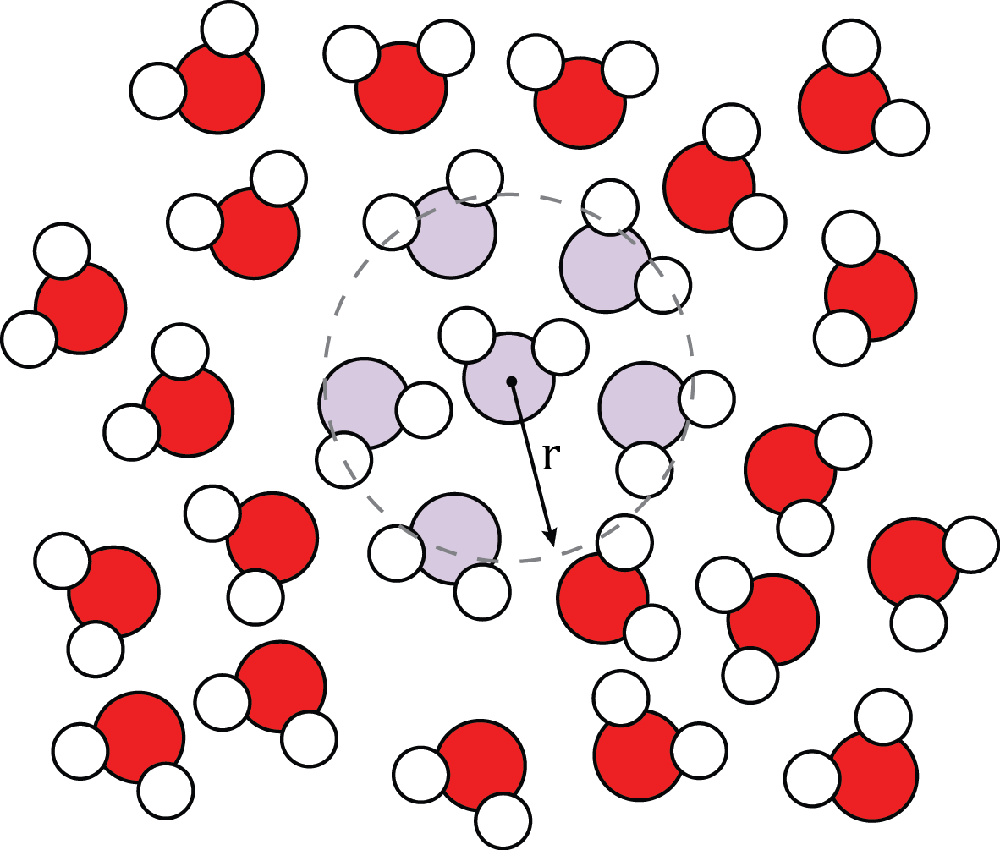
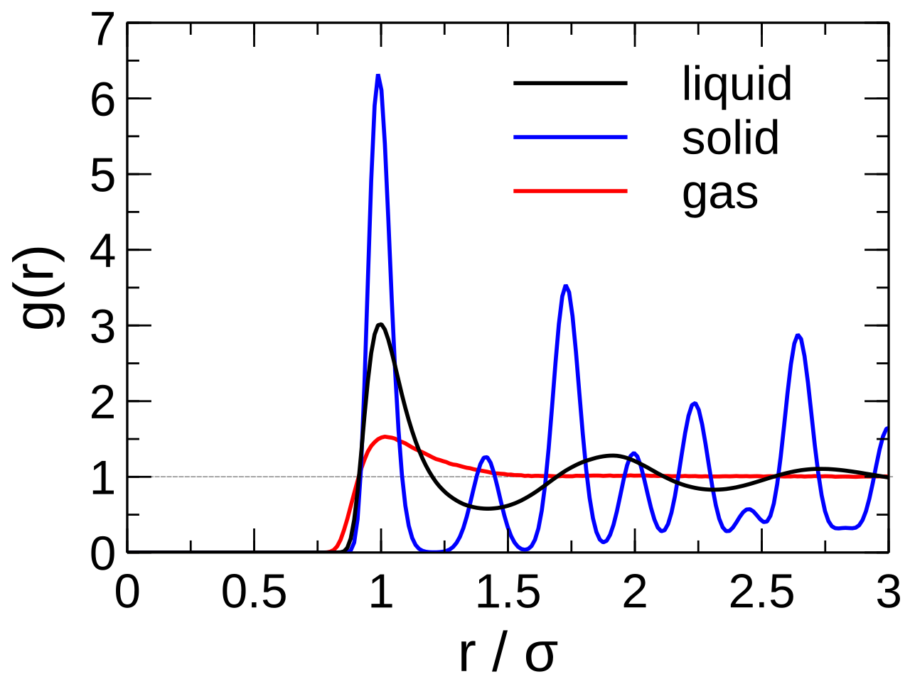
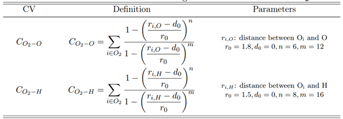
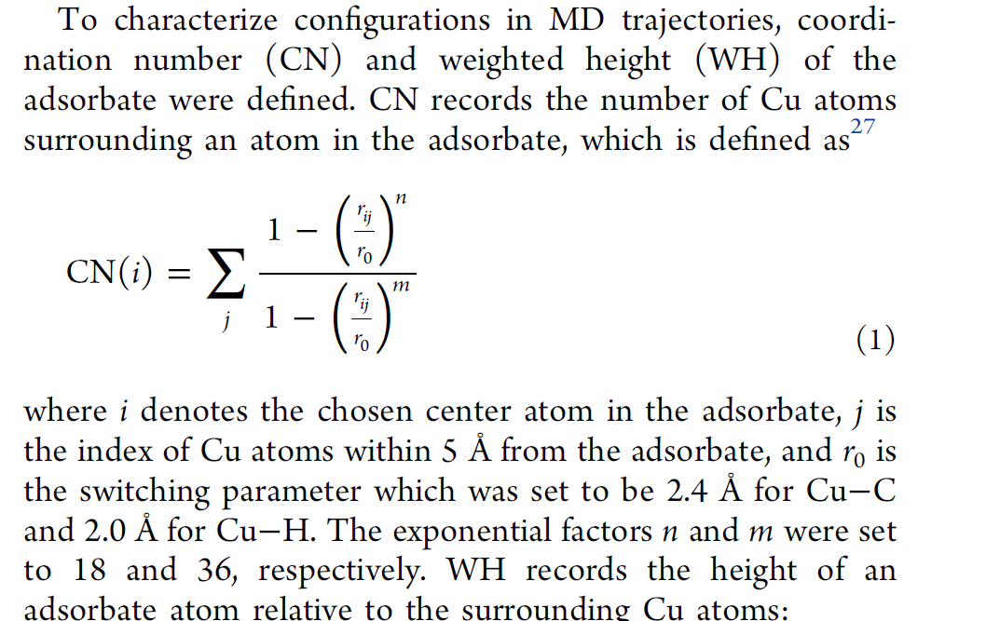

## radial distribution function (RDF)

### RDF define




径向分布函数，RDF，定义如下：

$$g(r)=\frac{dn_r}{dV_r∗\rho}\approx\frac{dn_r}{4\pi r^2 dr∗\rho}$$

其中$dN_r$是厚度为$d_r$的球壳中粒子数(上式中球壳体积仅在$d_r \rightarrow 0$时成立)

其物理意义是在一个粒子距离r处找到另一指定类型粒子的概率。

​$g(r)$​将平均密度​$\rho^{bulk}$​和局部密度​$\rho$​联系起来：

$$ \rho(r) = \rho^{bulk}g(r)  $$

位于中央的参考分子（粒子）附近（r值小）局部密度​$\rho$​不同于系统的平均密度​$\rho^{bulk}$​; 参考分子距离较远处的（r值大）局部密度​$\rho$​接近系统的平均密度​$\rho^{bulk}$​

### RDF in solid



固体是有规律的周期性体系，粒子在晶格位置附近震动。因此可以观察到两点：

- 由数个峰组成，峰与峰之间g(r)=0，说明峰之间找不到原子，因为粒子周期性排布
- 每个峰并非一个线，而是有宽度的，因为原子在晶格位置附近震动

### RDF in liquid

液体属于近程有序远程无序。当r较小，出现数个峰。第一个峰最尖锐，通常出现在​​​​$\sigma$​​​​,表示第一个coordination sphere（配位壳，即​​​​$dr$​​​​所定义的球壳状区域）;随后峰值将大致间隔​​​​$\sigma$​​​​出现，但高度远小于第一个。当r值增大，粒子之间彼此独立、无关，g(r)​​​$\rightarrow 1$​​​, ​​$\rho^{local}\rightarrow\rho^{bulk}$​​。

### RDF in gas

气体没有规则结构，真实气体RDF只有一个coordination sphere， 且将迅速衰减之气体的正常<!--[if mathML]><mml:math xmlns:mml="http://www.w3.org/1998/Math/MathML"><mml:msup><mml:mi>𝜌</mml:mi><mml:mrow><mml:mi>b</mml:mi><mml:mi>u</mml:mi><mml:mi>l</mml:mi><mml:mi>k</mml:mi></mml:mrow></mml:msup></mml:math><![endif]-->​​

- g(r) = 0, when r < $\sigma$
- g(r) > 1, when $\sigma < r < 2\sigma$
- g(r) = 1, when r > 2$\sigma$


## coordination number

coordination number, CN，配位数，用于表示每个coordination sphere（配位壳）中找到粒子的数量。个根据之前定义的RDF公式，在球坐标系中将径向分布函数g(r)积分至它的第一个极小值，得到配位数：

$$ n(r') = 4\pi\rho\int_0^{r'} g(r)r^2dr  $$

分子间相互作用，类似于LJ势，吸引力较弱且各向同性，斥力强且短程，因此当液体中分子间没有氢键或静电相互作用，分子将以有效的形式推积，从而避免排斥。最有效的排列方式就是每个粒子有12个近邻，即CN=12.

当分子间有氢键和静电作用，如水，CN将很小（在第一coordination sphere中=4~5），因为液体将使其在第一个coordination sphere中氢键作用最大化。


## calculation CN by Python

```python
# under building
from ase.io import read
```

## CN and applications in enhanced sampling

在增强采样中，CN定义为：

$$ \sum_{i \in A}1\sum_{j \in B} s_{ij} ​ $$

当原子i(属于groupA)和j(属于groupB)成键，​$s_{ij}$​=1，反之其他情况\=0。通常​$s_{ij}$​使用一个开关函数(switching function), 从而保证CV是连续变化可导的。通常，​$s_{ij}$​被定义为：

$$ s(r_{ij}) = \frac{1-(\frac{r_{ij}-d_0}{r_0})^n}{1-(\frac{r_{ij}-d_0}{r_0})^m}  $$

默认d~0~=0, n=6, m=2n

公式当中，​$r_{ij}$是两组原子i和j(分属于groupA和B)之间的距离。

$d_0$是公式的阈值，决定$r_{ij}$何时开始影响开关函数$s_{ij}$的值。当$r_{ij}$逐渐接近$d_0$，函数$s_{ij}$逐渐增大至1；当$r_{ij}$远大于$d_0$时，函数$s_{ij}$趋近于0。因此，可以将$d_0$理解为**原子间距离的切换点**，远离$d_0$，原子间相互作用显著减弱。

​$r_0$​用于控制函数​$s_{ij}$​的平滑程度，从而决定了当原子间距​$r_{ij}$​接近​$d_0$​时候，函数​$s_{ij}$​变化速度。当​$r_0$​越大，函数​$s_{ij}$​变化越平缓，配位数(​$s_{ij}$​)连续性越好。但是​$r_0$​过大，配位数(​$s_{ij}$​)变得不精确。至于配位数需要连续变化，是因为原子间相互作用强度连续变化而不是离散的。

当开关函数应用在配位数中，通常设置​​$d_0=0$​​,而将阈值的功能赋予给参数​​$r_0$​​。当​​$r_{ij}0.5$​​，视为两原子间成键。这样，我们通过设置不同的阈值​​$r_0$​​来区分不同的状态。对于阈值的选取，通常经验是设置在1.0-1.5 Å，在此基础上迭代优化阈值的选取。

其他类型的开关函数定义可见[plumed官网](https://www.plumed.org/doc-v2.7/user-doc/html/switchingfunction.html)

可使用邻居列表减少计算量，具体见[plumed官网](https://www.plumed.org/doc-v2.7/user-doc/html/_c_o_o_r_d_i_n_a_t_i_o_n.html)。其他操作及选项也可见前述网址。

一般用于侦测原子之间的键或侦测不同反应路径。







