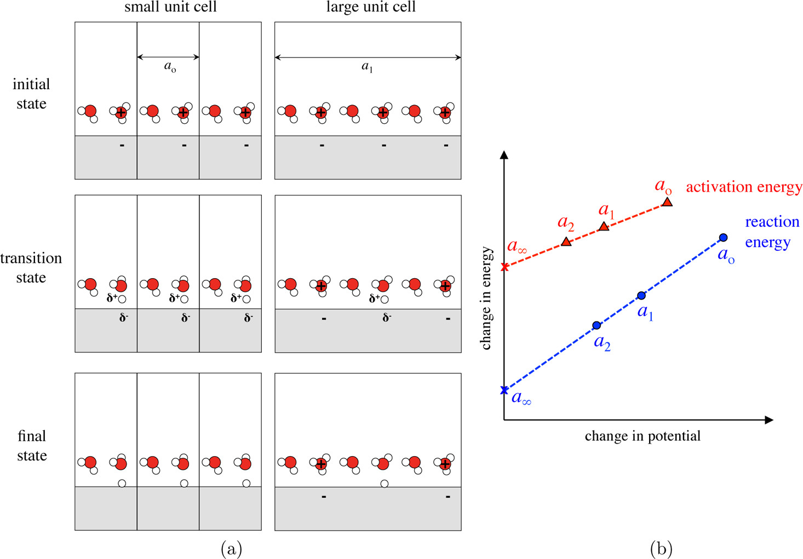

## 背景

现有的计算，大量的恒电荷体系，而实际上是恒电势体系。

一个电化学反应，电荷发生转移，界面的电荷密度和电势发生会变化

## 单元外推法

很容易可知功函数与（绝对电极电势 vs 标准氢电极电势）的关系：

$$ U_{SHE}=\frac{\phi-\phi_{SHE}}{e}  $$

其中​​$\phi_{SHE}$​​是SHE的绝对电极电势，实验确定为~4.44 eV（估值范围4.4 ~ 4.8 eV）。$\Phi$则为slab（具体到下文图片中的体系，包括水）的功函数，通过费米能级与真空静电势(真空能级)的差求得。这时候如果我们有体系沿着反应的功函数​$\phi$​的变化（一个PCET过程），自然就有体系的​$U_{SHE}$​沿着反应的变化。

考察一个PCET过程，表面吸附物种加H：

$$ *A + e^- + H^+ \rightarrow *AH  $$

该过程表面电荷为负的趋势越来越小，相应的功函数​$\phi$​越来越大。

当使用有限晶胞大小，盒子越小，电势变化的越明显（盒子越大，电极由于发生反应而变化的电荷被平均到每个电极原子上的值越小，电势变化越不明显）。因此可以通过逐渐扩大盒子大小，界面电荷密度变化越来越不明显，功函数变化也越来越小，直到电势恒定（电势不再随着反应变化），就实现了这个盒子大小下恒电势模拟。这种方法即为著名的“单元外推cell-extrapolation”法。

如[下图](https://pubs.acs.org/cms/10.1021/acs.jpclett.5b01043/asset/images/medium/jz-2015-01043w_0003.gif)所示,左图a展示不同大小盒子的体系，右图b展示了​$\Delta G_r$​或者​$\Delta G_a$​作为电极电势变化的线性函数。可见，随着盒子增大，（界面电荷密度变化越来越不明显），总有一个点，电势不再变化，此时的​$\Delta E$​即相当于恒电势下的​$\Delta E$​。不过大盒子计算成本高。

## 电荷外推法做恒电势校正

Nosrkov则提出了“电荷外推charge\-extrapolation”法，计算恒电势下PCET过程能垒计算校正，尽管模拟是在恒电荷下进行的。这个方法基于静电对反应能量贡献的电容器模型，利用界面电荷将恒电势和恒电荷的barrier联系起来。

这种方法两个假设：

1\. 化学和静电对反应能量的贡献可以分开

2\. 静电对PCET的贡献基本由电容器模型描述

假设两个恒定功函状态 1和2，使用恒定电荷计算，两个状态分别有功函数$\phi_1$和$\phi_2$，能量$E_1(\phi_1)$和$E_2(\phi_2)$，界面电荷$q_1$和$q_2$，则能量的恒电势校正为：

$$ \Delta E(\phi_1) = E_2(\phi_1)-E_1(\phi_1)=E_2(\phi_2)-E_2(\phi_1)+\frac{(q_2 - q_1)(\phi_2 - \phi_1)}{2}  $$

$$ \Delta E(\phi_2) = E_2(\phi_2)-E_1(\phi_2)=E_2(\phi_2)-E_2(\phi_1)-\frac{(q_2 - q_1)(\phi_2 - \phi_1)}{2}  $$

q定义为slab中过量电子的数量，等于溶液中离子的净电荷。可这样理解，对于之前考察的[PCET过程](#PCET):
$$*A + H^+ + e^- \to *AH $$
其中A是​被吸附的中间体。从IS到FS的反应过程，电荷变化有$\Delta q = q_{FS}-q_{IS}=0-1=-1$。对于从IS到TS的过程，可以使用唯象定律[Butler–Volmer kinetics](https://pubs.rsc.org/en/content/articlelanding/1924/tf/tf9241900729)的转移系数$\beta$确定电荷转移量，假设TS有：

$$[*A \dots H]^{+(1-\beta)}+(1-\beta)e^-$$

即发生了$\beta$量级别的电荷转移，电荷差$\Delta q= q_{TS}-q_{IS} = (1-\beta)-1 = -\beta$

继续恒电势校正的推导，上面两式下减上得：

$$\Delta E(\phi_2) - \Delta E(\phi_1) = -\Delta q(\phi_2 -\phi_1)$$

将$\phi_1$换为参考值$\phi_{ref}$，比如SHE，$\phi_2$为自变量，有：

$$\Delta E(\phi) -\Delta E(\phi_{ref}) = -\Delta q(\phi - \phi_{ref})$$

进而得到：

$$ \frac{d\Delta E}{d \phi} = -\Delta q  $$

## 物理图像（对恒电势含义的思考）

对于上面的微分形式，可以有多种解释，我的理解是，对于状态1到状态2或者状态ref到自变量的过程，无论处于何种功函​​$\phi$​​下，电荷的变化​​$\Delta q=q_2 -q_1$​​是相同的。但是不同功函下能量变化却是不同的，而这种“比例”即为电荷变化的负数​​$-\Delta q$​​。官方的解释是电荷的变化给出了电化学过程能量变化的电势依赖性。而且，这种依赖性是**线性变化**的，Norskov的[JPCL Figure 2](https://pubs.acs.org/doi/10.1021/acs.jpclett.6b00382)给出了一个PCET过程在多个功函数​$\phi$​下的计算结果，发现确实呈现线性变化。据此我们可以**外推**至任意电压下的电势和能量变化之间的关系。

## 电荷差值计算
对于PCET过程，通常计算的​​$\Delta q=q_{FS}-q_{IS}\approx -0.7 eV$​​ 每个状态的q定义为q定义为“slab中过量电子的数量，等于溶液中离子的净电荷”。“slab中过量电子”指电极表面（催化剂）的电荷，推导过程中说明了这一点。可以使用诸如Barder电荷等分解方案，先计算体系每个原子的电荷，然后再对属于slab原子的电荷求和；当发生吸附或者脱附，属于slab的原子不变，因为考察的是电极表面（催化剂）。这个差值不为\-1不是因为电荷分解方案的误差，而是低精度DFT的自相互作用误差产生的分数界面电荷。这个误差会影响HOMO-LUMO gap。当fermi level 在HOMO-LUMO之间，就会发生界面上的人工电荷转移，使用杂化泛函或者校正过自相互作用的泛函会改善这个误差（似乎程俊、王峰的电解质文献中提到过这个问题，以及电化学界面的电子能级排列，电极电势排列，电解液HOMO、LUMO和金属电极的费米能级 [Chemical Physics Letters 2013](https://www.sciencedirect.com/science/article/pii/S0009261412013310), [Electrochimica Acta 2013](https://www.sciencedirect.com/science/article/pii/S001346861300741X)）。
 当考察的$\beta = -\Delta q$不是初末态差值而是TS-IS，$H*+H^+ + e^- \to H_2 + *$和$*OH+H^+ + e^- \to H_{2}O + *$两个不同过程的$\beta$差别很大。一般认为都是0.5，但是计算结果显示前者为0.5而后者约为0。可能影响因素有：溶剂重组、离子转移或键断裂。

## 电压的计算
对选定的状态的结构执行单点能计算，使用vaspkit `426`计算功函数$\Phi$,然后根据$U_{SHE}=\frac{\phi-\phi_{SHE}}{e}$计算得到U v.s. SHE。

## 能量恒电势校正的推导过程

### 假设

假设，对于通过电化学界面的指定数量的电荷转移，其对能量变化的“化学”和“静电”贡献是可分：

$$ E = E_{short}+ E_{elec}  $$

考察一个PCET过程，假设吸附物不是强偶极子，自身不发生重定向，也不使溶剂重组，那么电荷转移导致的能量变化中“静电”部分是纯电容性（capacitive）的，即​$E_{elec}=E_{cap}$​。假设表面电荷密度为$\theta = \frac{q}{N}$,其中q是带电离子的数量，N是晶胞中表面原子的数量。则每个表面原子的电容和电容能量分别为：

$$ C=-\frac{e\theta}{U-U_{pzc}}     \qquad \qquad \qquad   E_{cap}=\frac{e^2 \theta^2}{2C}  $$

对于考察的这个PCET过程，假设初态为1，TS或末态为2，那么N个表面原子总的能量变化中电容（静电）的贡献为：

$$ E_{cap,2}-E_{cap,1}=N[\frac{e^2}{2C}(\frac{q_2}{N})^2-\frac{e^2}{2C}(\frac{q_1}{N})^2] $$

$$ =\frac{e^2}{2CN}[q_2^2-q_1^2] = \frac{e^2}{2CN}[2(q_2 - q_1)q_1 + (q_2 - q_1)^2] $$

$$ =\frac{e^2}{2CN}(q_2 - q_1)(q_1 + q_2)=\frac{e^2}{2CN}(q_2 - q_1)[\frac{NC(U_{PZC}-U_1)}{e} + \frac{NC(U_{PZC}-U_2)}{e}]  $$

$$ =\frac{e^2}{2CN}(q_2 - q_1)[\frac{NC}{e} ((U_{PZC}-U_1+U_{PZC}-U_2))] =\frac{e^2}{2CN}(q_2 - q_1)[\frac{NC}{e} ((2U_{PZC}-2U_1-U_2+U_1))] =\frac{e^2}{2CN}(q_2 - q_1)\left\{ \frac{NC}{e} \left[ -2(U_1 - U_{PZC})-(U_2 -U_1) \right] \right\}  $$

$$ =e(q_2 -q_1)\left[ -(U_1 -U_{PZC}) -\frac{U_2 -U_1}{2}   \right] $$

其中$q_2 -q_1$是从状态1到2的电荷变化。上式中括号中$\frac{U_2 -U_1}{2}$即为有限盒子尺寸的贡献。当盒子趋向于无穷大，$U_2 -U_1$和$q_2 -q_1$都接近0。因此中括号剩下的$U_1 -U_{PZC}$即为系统在恒电势U~1~条件下，静电（电容）部分对$\Delta E_{2-1}$的贡献。根据这个思路，可以将能量变化拆解为2部分，对于恒电势U~1~部分，直接使用恒电势能量变化；对于有限盒子大小部分，使用推导的能量值，即：

$$ E_2 (U_2)-E_1 (U_1)=\left[ E_2 (U_1)-E_1 (U_1)  \right] - \frac{e(q_2 -q_1)(U_2 -U_1)}{2}  $$

将电压换成 功函数，且重排上式，让恒电势项在等号左边，恒电荷项和有限盒子大小项放在等号右边：

$$ E_2 (\phi_1)-E_1 (\phi_1)=\left[ E_2 (\phi_2)-E_1 (\phi_1)  \right] + \frac{e(q_2 -q_1)(\phi_2 -\phi_1)}{2}  $$

将上式中状态1和状态2互换（角标改变），有：

$$ E_1(\phi_2) -E_2(\phi_2) = [E_1(\phi_1)-E_2(\phi_2)] + \frac{e(q_2 -q_1)(\phi_2 -\phi_1)}{2}  $$

等式左右加负号

$$E_2(\phi_2)-E_1(\phi_2)=[E_2(\phi_2)-E_1(\phi_1)]-\frac{e(q_2 -q_1)(\phi_2 -\phi_1)}{2}$$

这就是在$\phi_2$恒电势条件下的校正

# Ref:

[Electrochemical Barriers Made Simple | The Journal of Physical Chemistry Letters (acs.org)](https://pubs.acs.org/doi/10.1021/acs.jpclett.5b01043)

[Potential Dependence of Electrochemical Barriers from ab Initio Calculations | The Journal of Physical Chemistry Letters (acs.org)](https://pubs.acs.org/doi/10.1021/acs.jpclett.6b00382)

