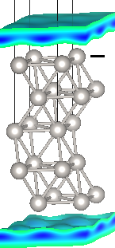
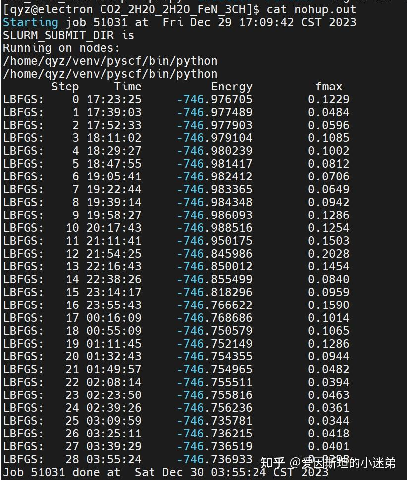
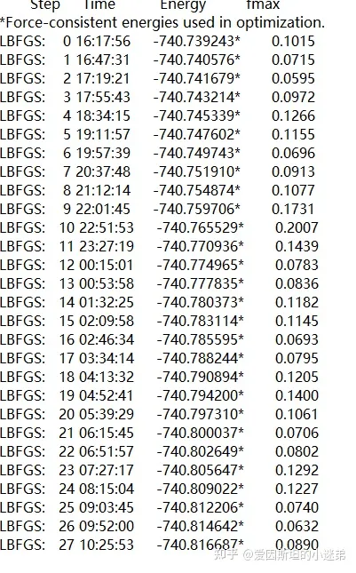
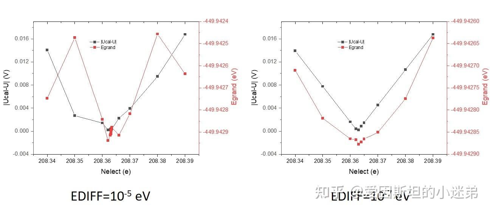

!!! info "转载说明"
    已剪辑自: [https://zhuanlan.zhihu.com/p/676795392](https://zhuanlan.zhihu.com/p/676795392)
# DFT视角下的恒电势数学模型及物理意义-电子调控的恒电势
**首先声明，所有模拟方法都有漏洞，没有任何方法是完美的，根据自己的研究内容选择最适合自己的方法即可，不要迷信某一种方法绝对正确。**

**人不可能做到绝对理性，所有算法都会有bug，但我们对于问题的理解程度会随着时间越来越深刻，要用发展的眼光看待过去的事物。**

## 什么是恒电荷模拟

在了解恒电势模拟之前，我们先要了解恒电荷模拟。恒电荷模拟就是进行电化学模拟时，体系的电荷保持不变。周期性体系中改变电荷比较危险（后文会详细介绍），因此最保险的做法就是只计算不带电荷的中性体系。

但是电化学步骤中很多基元反应涉及离子和电荷转移。中性体系无法获得此类基元反应的自由能，通常的做法是采用Nørskov著名的计算氢电极模型(CHE model)，根据某个电化学反应的标准电极电势和能斯特方程计算某个浓度和电压下离子的自由能。

中性表面与带电表面对中间体的吸附差异非常大，如果要模拟带电表面，可以在表面放置几个反号离子，比如模拟带负电的表面，可以在表面放置几个K原子。由于整个体系是中性的，K原子容易释放电子变成K+离子，表面得到电子变成带负电的表面(DFT做电子结构优化自动得到这样的电子结构分布，更多讨论见[Wiki: 偶极、极化、电场、力场、恒电荷、氧化还原能力 王飞腾博士讨论](../../力场下的恒电势/Dipole-polarization-electric_field-force_field-constant_charge-redox_capacity))。控制K原子的数量就可以控制表面电荷量，从而模拟表面带不同电量时对物种的吸附。

## 什么是恒电势模拟

恒电荷模拟有许多问题无法解决，比如无法模拟涉及电荷转移的基元步骤的过渡态，无法模拟电极表面的电荷随反应进行的涨落等等，因此要用到恒电势模拟

恒电势模拟有很多个名字，比如grand canonical method，fix-potential method，constant potential method，fix-Fermi-level method等等，其实都是类似的。顾名思义，就是让体系的电势固定，而让电荷涨落。它首先要解决周期体系带电的问题。

### 周期性体系带电问题
周期体系一个晶胞带电相当于所有周期镜像全部带电，这会导致电子的电势能变成无穷。为了计算带电体系，大多数第一性原理软件(比如VASP)会在晶胞中加入**均匀背景电荷**平衡掉体系的净电荷，从而使晶胞仍然是中性。**均匀背景电荷**本身是不物理的，如果我们的体系是一个表面(slab)与真空层组成，那么真空层的任何位置都会有背景电荷。**无论真空层取得多大，真空的静电势随真空层厚度的变化趋势永远不会收敛**，电子没有一个稳定的能量参考点。所以在周期性体系里加电荷算出的能量不准，该操作非常危险。（单独优化结构没有太大问题，用来对比能量时无法保证不同体系的真空能级一致）

该问题可以通过引入隐式溶剂模型解决。隐式溶剂模型的本质是将溶剂当作具有某种介电常数的连续流体，通过泊松玻尔兹曼方程计算溶剂化能。极性溶剂对表面电荷和偶极都有屏蔽作用，所以电子的静电势不会受到周期镜像净电荷的影响。类似于带电表面在溶剂中诱导出bound charge和偶极，抵消了带电表面本身的影响。并且不同于均匀背景电荷，诱导出的bound charge可近似理解成电极在溶液中吸附的反号电荷，具有物理意义。加入隐式溶剂后，真空静电势很容易收敛。

[https://jdftx.org/FixedPotential.html](https://jdftx.org/FixedPotential.html)

### 恒电势数学模型

真实的电化学环境中电子来源于电源，但电源又在我们研究的系统（电极表面）之外，电源是环境中的电子的粒子源。电子的能量参考点为电源中电子的化学势（$\mu$），恒电势意味着$\mu$是常数。在巨正则（grand canonical）系综中，巨正则能量（$\Omega$）需要通过正则能量($\mathbf{A}$)扣掉电子能量参考点的能量 $[(N_e-N_{e,PZC})\mu]$ 。

$$ \Omega(\mathbf{\vec{r_n}},N_e) = A(\mathbf{\vec{r_n},N_e}) - (N_e - N_{e,PZC})\cdot \mu$$

等式两边同时取全微分

$$ \nabla  \Omega d\vec{r_n} + \frac{\partial \Omega}{\partial N_e} dN_e = \nabla A d\vec{r_n} + \left(  \frac{\partial A}{\partial N_e}- \mu   \right) dN_e  $$

观察全微分的系数，得到：

$$ (\nabla \Omega - \nabla A)d\vec{r_n} = [(\frac{\partial A}{\partial N_e} - \mu) - \frac{\partial \Omega}{\partial N_e}] dN_e  $$

如果​​$\frac{\partial\Omega}{\partial N_e}=\frac{\partial A}{\partial N_e}-\mu=E_{Fermi}-\mu$​​

那么 ​$\nabla\Omega=\nabla A=-F$​ ，正则系综的力完全等同于巨正则系综的力。我们可以直接把软件计算出的正则系综的力用于巨正则系综的结构优化。在做结构优化得到能量极小值点时，力 ​$F=-\nabla\Omega=-\nabla A=0$​ , 且 ​$\frac{\partial\Omega}{\partial N_e}=E_{Fermi}-\mu=0$​ ，即费米能级必须收敛于$\mu$，这也是为什么有的地方称这种计算叫做fix-Fermi-level method。实现方法也很简单，就是给体系中增加或减少电子，使得费米能级等于$\mu$。

具体的计算代码可以参考：

[GitHub FCP-vasp-ase](https://link.zhihu.com/?target=https%3A//github.com/hellozhaoming/FCP-vasp-ase)  2.0 版本  
相应的论文: [JCTC 2023, 19, 15, 5168–5175  夏招明，肖海： Grand Canonical Ensemble Modeling of Electrochemical Interfaces Made Simple](https://doi.org/10.1021/acs.jctc.3c00237) 对应代码的1.0版本  

### 波恩-奥本海默近似在电化学界面的应用

如果把​$\frac{\partial\Omega}{\partial N_e}=E_{Fermi}-\mu=0$​ 的状态当作电子数的基态，把​$F=-\nabla\Omega=-\nabla A=0$​ 当作结构变化的基态。通常（尤其是导体）电子传输的速率比原子移动的速率快很多，所以电子数基态很容易到达，结构演变在电子数基态上进行，采用这个近似即让每一个离子步的电子数收敛，进行力相关的模拟，比如波恩奥本海默分子动力学(BOMD),过渡态搜索（NEB，dimmer）等。

有些文章认为并不是每一个离子步其电子数都到达了基态，电子转移的速率受限于电极的电容和电阻（欧姆定律）。因此每一个离子步的电子数不一定完全收敛，每个时间步长改变的电子数上限由电极的电容和电阻决定。如果电子数没有达到基态，即体系的费米能级在μ附近涨落，类比于允许某个温度下体系的温度涨落可以定义热浴（thermostat），也可以定义potentiostat使费米能级在μ附近涨落。参考这篇文章：

[PhysRevLett.126.136803 2021 Dielectric Properties of Nanoconfined Water: A Canonical Thermopotentiostat Approach](https://journals.aps.org/prl/pdf/10.1103/PhysRevLett.126.136803)

上述方法基于恒电容假设，即电容是一个常数。也有文章认为电容不可能是一个常数，结构涨落必然导致电容涨落，电容不是一个常数，而是随结构的变化而变化。电容涨落、电子数涨落、电势涨落三者是相互耦合的。每一离子步都计算出电容，然后根据欧姆定律计算电子数的变化量：

[JCTC_肖海](#JCTC_xiaohai)

## 恒电势计算的那些坑

### 1.用了隐式溶剂模型就千万别加任何形式的dipole矫正

隐式溶剂模型本身就可以屏蔽表面的dipole，如果加了dipole矫正，反而多了额外的dipole，此时原子受力不正确，结构优化时优化不到能量极小值点。

IDIPOL=3,结构优化时能量可能越来越高

没有加IDIPOL，能量越来越低

### 2.隐式溶剂和显式溶剂尽量不要混用

隐式溶剂不能描述氢键作用以及其他的溶剂量子效应，所以很多人想再加显式溶剂。由于隐式溶剂是连续介质模型，显式溶剂的分子间隙中也会存在隐式溶剂，同时使用两种溶剂等于计算了两遍溶剂效应，力是错误的，溶剂分子容易散掉。如果一定要加显式溶剂，推荐使用GPAW的SJM模型，可以定义solvated jellium的边界范围，使其与显式溶剂不交叠。

[Solvated Jellium Method (SJM)](https://gpaw.readthedocs.io/tutorialsexercises/electrostatics/sjm/solvated_jellium_method.html)

或者不使用隐式溶剂，直接显式溶剂加均匀带电平板模型平衡掉体系的净电荷。

有些文章同时使用了显式的水分子层和隐式溶剂，但是显式水分子层没有散，说明他们的脚本里原子的受力排除了溶剂效应double counting的影响，或者使用自定义的隐式溶剂模型实现隐式溶剂显式溶剂边界不重叠

### 3.能量参考点要统一

恒电势计算中电子的能量参考点是电源的μ，这个μ是环境中粒子源的化学势，与系统无关。很多文章里能量表达式里把μ替代成了系统内部的费米能级。这在费米能级完全收敛于μ时没有影响，但如果收敛阈值不够高，将会带来能量误差。

许多第一性原理计算的软件，比如vasp，电子能的能量参考点是系统的平均静电势，不是真空静电势，所以真空能级非零。而电子的化学势μ通常转化成绝对电极电势的形式，能量参考点是真空，所以**不论是费米能级还是电子能，全都要做真空能级矫正。**尤其是体系电荷改变会导致真空能级改变，如果没有真空能级矫正可能得出错误的能量。

如何判断自己的能量矫正是对的？

很简单，改变电子数，做一系列的静态计算，观察得到的能量极小值点是不是电势收敛的点。同时要注意提高电子步计算精度，如果精度太差，恒电势计算很难收敛。

### 4.如果电势难以收敛，提高电子步的精度

如上图，如果电子步精度不够，势能面误差大，任何程序都难以找到能量极小值点

### 5.强电场下慎用隐式溶剂模型

如果离子带正电，同时电极带很强的负电，二者又靠的很近，离子和电极之间有很强的电场，可能在隐式溶剂中极化出无数不物理的偶极，类似于介质被强电场击穿，离子（与表面）通过这些偶极相互作用，而无法描述离子（与表面）直接的相互作用。结构优化完后一定要做一个bound charge图，观察电荷分布是否符合物理图像。

（未完待续，欢迎在评论区补充你遇到的坑）

**（原创文章发布不易，转载请注明出处）**

